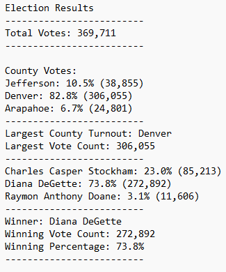

# Election Analysis
## Project Overview
The Colorado Board of Election gave me a job to complete an audit of the election in a local congression. They wanted to see the following:

1. The total number of votes cast
2. A complete list of candidates who received votes
3. The percentage of votes each candidtae won
4. The total number of votes each candidate won
5. The winner of the election based on popular vote

## Resources
Data source - Resources/election_results.csv

Software - Python 3.9.13 (main, Aug 25 2022, 23:51:50) [MSC v.1916 64 bit (AMD64)]

Visual Studio Code ver. 1.73.1

## Results
The analysis of the data show that:
- There were 369,711 votes cast in the election.
- The candidates were: 
    - Charles Casper Stockham
    - Diana DeGette
    - Raymon Anthony Doane
- The results were: 
    - Raymon Anthony Doane: received 3.14% of the vote. (11,606)
    - Charles Casper Stockham: received 23.0% of the vote. (85,213)
    - Diana DeGette: received 73.8% of the vote. (272,892)
- The winner of the election was: 
    - Diana DeGette, who received 73.8% of the vote and 272,892 total votes.
    
### County Numbers
To dive deeper into the votes, the Board of Elections requested the votes be narrowed down to the county level. Further analysis show: 
- The county votes were:
    - Arapahoe cast 24,801 votes which was 6.7% of the total vote.
    - Denver cast 306,055 votes which was 82.8% of the total vote.
    - Jefferson cast 38,855 votes which was 10.5% of the total vote.

It is clear Denver county casted the most total votes by a huge margin with 82.8% of the total votes.

## Summary
In summary, the Python code written for this audit worked successfully. I believe this code could be used for much larger juristictions. It was a great idea to try this with a smaller sample size, but the code could definitely handle larger groups. With some modifications to the reader section: 
``` 
    for row in reader:

        # Add to the total vote count
        total_votes = total_votes + 1

        # Get the candidate name from each row.
        candidate_name = row[2]

        # 3: Extract the county name from each row.
        county_name = row[1]
```
We would need to expand our variables to include State votes. We would also modify this next piece of script to show the voting percentage for each state and we could also compare each state to the nation. 
```   
    for county_name in county_votes:
        # 6b: Retrieve the county vote count.
        voters = county_votes.get(county_name)
        # 6c: Calculate the percentage of votes for the county.
        voter_percentage = float(voters) / float(total_votes) * 100

         # 6d: Print the county results to the terminal.
        county_results = (
            f"{county_name}: {voter_percentage:.1f}% ({voters:,})\n")

        print(county_results)
         # 6e: Save the county votes to a text file.
        txt_file.write(county_results)

         # 6f: Write an if statement to determine the winning county and get its vote count.
        if (voters > largest_turnout) and (voter_percentage > county_percentage):
            largest_turnout = voters
            largest_county = county_name
            county_percentage = voter_percentage
```
The results will print out in an easy to read .txt file. The results would look like this:



The results that came from this audit were accurate, and using this same formula will result in equally accurate results for larger scales. 

